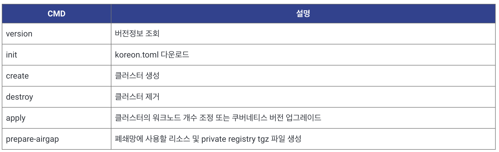

# kore-on

kore-on automates k8s installation tasks for on-premise.
It also provides upgrade cluster and scale up/down worker nodes.

## Features
- Deploys Single or Highly Available (HA) Kubernetes
- Upgrade Kubernetes cluster
- Add/Delete worker node
- Install harbor registry
- Install NFS server
- Air-Gap installation

## Documentation

Documentation is in the `/docs` directory

## Supported Linux Distributions

- **Ubuntu** 20.04
- **CentOS/RHEL** 8

## Supported Components

- Core
  - [kubernetes](https://github.com/kubernetes/kubernetes/tree/master/CHANGELOG) v1.20.6-v1.20.8, v1.21.0-v1.21.12, v1.22.1-v1.22.9, v1.23.1-v1.23.5
  - [etcd](https://github.com/etcd-io/etcd/releases) v3.4.16
  - [docker-compose](https://github.com/docker/compose/releases) v1.29.2  
  - [docker](https://www.docker.com/) v19.03.15
  - [containerd](https://containerd.io/) v1.4.3
  - [crictl](https://github.com/kubernetes-sigs/cri-tools) v1.19.0, v1.20.0, v1.21.0
  
- Network Plugin
  - [calico](https://github.com/projectcalico/calico/releases) v3.19.1, v3.20, v3.21, v3.22, v3.23
  
- Application
  - [coredns](https://github.com/coredns/coredns) v1.7.0, v1.8.0
  - [haproxy](https://hub.docker.com/_/haproxy?tab=tags&page=1&ordering=last_updated) v2.4.2  
  - [nfs-subdir-external-provisioner](https://github.com/kubernetes-sigs/nfs-subdir-external-provisioner/releases) v4.0.2  
  
- Registry
  - [harbor](https://github.com/goharbor/harbor/releases) v2.3.0
  - harbor proxy mirroring
  
## Required packages
 * Podman(container tools) - This is required, if not installed it will be installed automatically.

## go-ansible 
Go-ansible is a package for running ansible-playbook or ansible commands from Golang applications.

## Getting Start

Kore-on은 On-premise 환경에서 Kubernetes cluster의 생성, worker node 추가/삭제, 클러스터 업그레이드, 클러스터 삭제 기능을 제공한다. 또한, Harbor registry와 NFS server를 함께 설치함으로 운영환경에서 즉시 사용할 수 있으며, 폐쇄망(Air-gap) 환경을 위해 압축파일(Harbor, system package)로 클러스터를 설치할 수 있는 기능을 제공한다. 대상 서버의 정보(IP, SSH key)등을 koreon.toml파일에 기술하고 간단히 koreonctl create 명령을 실행하면 간단히 설치된다.

### Deploy kubernetes HA cluster using koreon

- Kore-on 명령어: koreonctl

-----
## Documents

- See our documentation in the /docs repository, please [find the index here](/docs/README.md).

