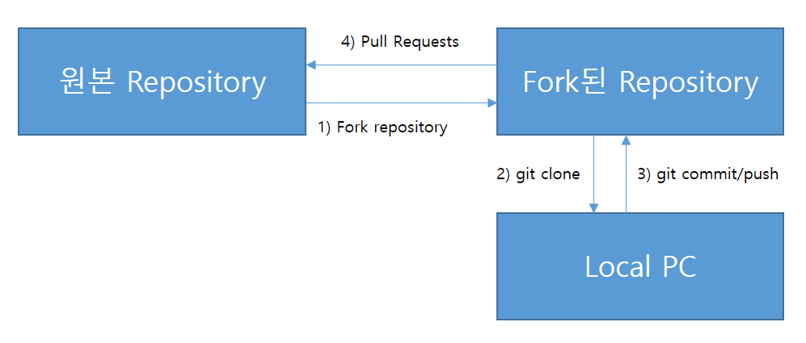
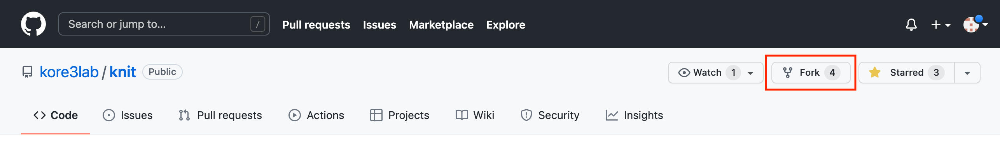
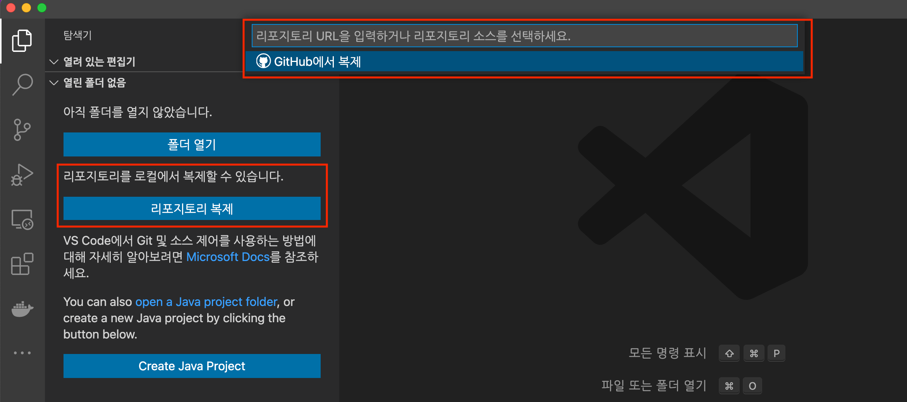
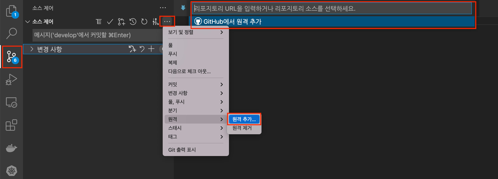
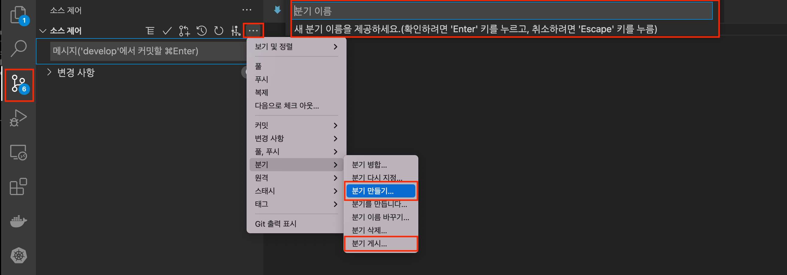
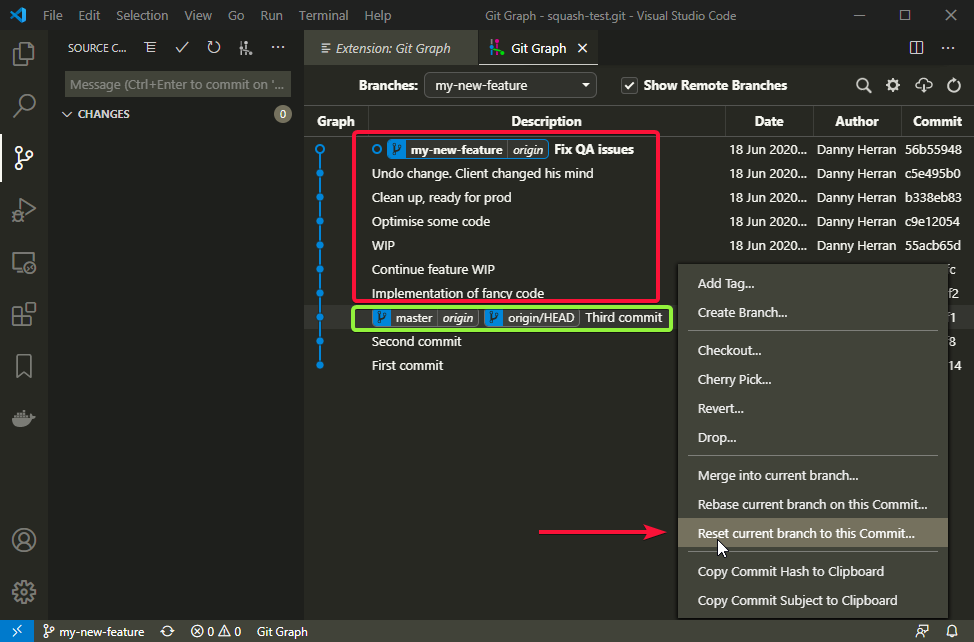
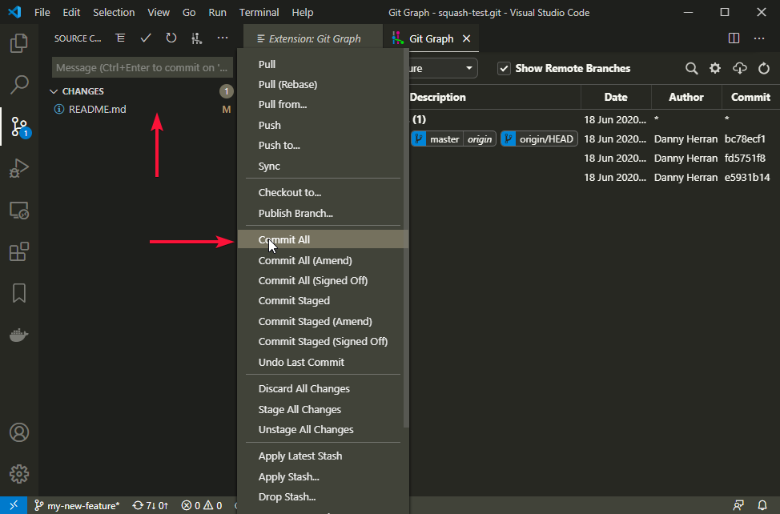
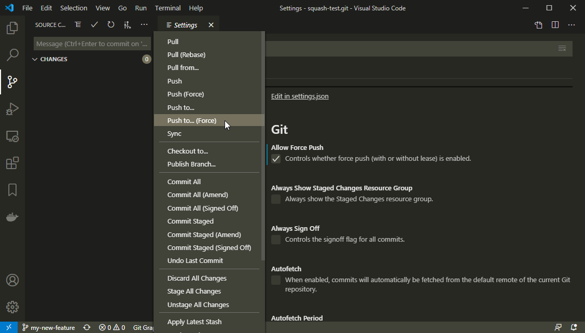

- [Contributor Guide with Vscode](#contributor-guide-with-vscode)
  - [Branch 전략](#branch-전략)
    - [Git-Flow](#git-flow)
    - [Summary](#summary)
  - [Contributing](#contributing)
  - [Pull Request를 위한 전반적인 Flow](#pull-request를-위한-전반적인-flow)
  - [install pugin for vscode - optionall](#install-pugin-for-vscode---optionall)
  - [Pull Request Work Process](#pull-request-work-process)
    - [Fork & Clone](#fork--clone)
    - [개발 준비](#개발-준비)
    - [개발 완료 후 Pull Request 생성](#개발-완료-후-pull-request-생성)
    - [리뷰 승인 및 Pull Request를 merge](#리뷰-승인-및-pull-request를-merge)

# Contributor Guide with Vscode
vscode를 사용한 Github Contribution 방법 소개

## Branch 전략

### Git-Flow


* [Basic Git Flow For Making Open Source Contributions on GitHub](https://dnncommunity.org/blogs/Post/1470/Basic-Git-Flow-For-Making-Open-Source-Contributions-on-GitHub)
* [우린 Git-flow를 사용하고 있어요](https://woowabros.github.io/experience/2017/10/30/baemin-mobile-git-branch-strategy.html)

### Summary

* 개발은 원본(kore3lab/kore-on) repository를 fork 받아 로컬 repository 에서 수행하고 "Pull Reuqest"를 통해 리뷰 프로세스 수행
* 리뷰가 완료되면 원본(kore3lab/kore-on) repository의 branch에 merge 하여 반영
* Feature 개발 : `develop` branch에서 로컬 branch를 생성&개발 후 원본 repository의 `develop` branch에 merge
* Hotfix 개발 : `master` branch에서 로컬 branch를 생성&개발 후 원본 repository의 `develop` 와 `master` branch에 merge
* Release 개발 : `develop` branch에서 로컬 branch를 생성&개발 후 원본 repository의 `masater` 와 `develop` branch에 merge
* Release/Hotfix 완료 후 태깅처리하여 릴리즈 출시
* 태깅 및 `master` branch로의 merge 작업은 관리자(owner) 권한 사용자가 수행

## Contributing

## Pull Request를 위한 전반적인 Flow


1) Pull Requests를 올리고자 하는 repository를 fork 한다. 
2) fork한 repository 를 Local PC 에 git clone 한다. 
3) 수정 commit을 fork한 repository에 push 한다. 
4) push한 commit을 원본 repository 에 pull requests 한다. 


## install pugin for vscode - optionall

- GitLens
- Git Graph
- GitHub Pull Requests and Issues

## Pull Request Work Process

### Fork & Clone
1) 원본 Repository([kore3lab/kore-on](https://github.com/kore3lab/kore-on)) 의 우측 상단 "Fork" 버튼을 눌러 fork repository(girhub-user/kore-on) 생성.



2) vscode에 fork된 repository를 연동(git clone) 한다.
```sh
$ git clone https://github.com/kore3lab/kore-on.git
$ git remote -v
origin  https://github.com/xxxxx/kore-on.git (fetch)
origin  https://github.com/xxxxx/kore-on.git (push)
```


3) 원격 저장소(프로젝트의 원래 저장소)를 설정한다.
```sh
$ git remote add upstream https://github.com/kore3lab/kore-on.git
$ git remote -v
origin  https://github.com/xxxxx/kore-on.git (fetch)
origin  https://github.com/xxxxx/kore-on.git (push)
upstream        https://github.com/kore3lab/kore-on.git (fetch)
upstream        https://github.com/kore3lab/kore-on.git (push)
```


### 개발 준비

1) develop branch로 이동
```sh
$ git checkout develop
$ git branch

* develop
  master
```

2) 리모트 최신소스를 forked repository develop branch와 동기화 (rebase)

3) 작업할 브랜치를 생성하고, 해당 브랜치로 이동한다.
   - 로컬 Branch 생성: git plugin -> 분기 만들기 -> 분기 이름(예: feature/username)
   - github(fork repository) Branch 게시: 로컬에 생성된 Branch를 github에 생성 하기 위해서는 분기 게시를 한다.
    ```sh
    $ git branch
    * master
  
    $ git switch -c feature/haproxy
    ```
   


### 개발 완료 후 Pull Request 생성
Pull Request를 생성 하기 위한 전반적인 flow는 아래와 같다.

- 로컬 개발 완료
- 리모트 upstream repository develop branch와 forked repository develop branch를 최신소스로 동기화(fech/rebase)
- 리모트 origin(forked) repository develop 브랜치와 리모트 origin feature/username 브랜치 merge

1) **(필수)** 개발된 로컬 branch의 commit을 업무에 맞도록 정리(squash) 작업 수행
   1) 충돌 해결을 미연에 방지 효과
   2) [커밋 합치기(squash)](https://meetup.toast.com/posts/39) 섹션 참조 또는, [VS Code에서 Git 스쿼시 커밋](https://dannyherran.com/2020/06/git-squash-commit-vs-code/) 섹션 참조
```sh
# Git Squash
$ git log --pretty=oneline
$ git rebase -i HEAD~3
```
**(또는)** VS Code에서 Git 스쿼시 커밋 (GitGraph plugin 사용)
-  GitGraph 로그로 이동하여 유지하려는 커밋보다 이전 커밋을 마우스 오른쪽 버튼으로 클릭합니다. 예를 들어 모든 커밋을 빨간색으로 스쿼시하려면 녹색 커밋을 마우스 오른쪽 버튼으로 클릭한 다음 "현재 분기를 이 커밋으로 재설정..."을 선택합니다.


-  그러면 왼쪽에 이전에 있었던 모든 커밋에 속하는 단계적 변경 사항이 표시됩니다. "모두 커밋 ..."으로 진행하십시오.


-  마지막으로 원본 커밋으로 강제 푸시를 수행하여 기존 커밋을 모두 단일 커밋으로 교체합니다.


   


2) **(필수)** 리모트 repository의 최신소스를 forked repository develop branch와 동기화(rebase)
```sh
$ git fetch upstream
$ git rebase upstream/develop
```


### 리뷰 승인 및 Pull Request를 merge 
1) 같은 feature를 개발하는 동료에게 리뷰 승인을 받은 후 자신의 Pull Request를 merge합니다. 만약 혼자 feature를 개발한다면 1~2명의 동료에게 리뷰 승인을 받은 후 Pull Request를 merge합니다.

2) fork repository의 작업 브랜치들은 Pull Request를 요청 후 merge와 함께 삭제합니다. feature 브랜치 역시 develop 브랜치에 merge 되면 바로 삭제하고 있습니다.
