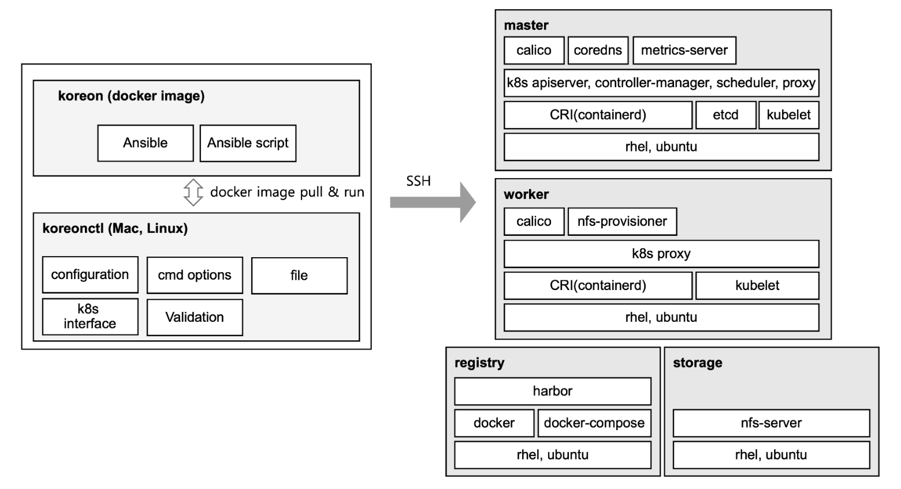

# Kore-on Architecture

Kore-on은 On-premise 환경에서 Kubernetes cluster의 생성, worker node 추가/삭제, 클러스터 업그레이드, 클러스터 삭제 기능을 제공한다. 또한, Harbor registry와 NFS server를 함께 설치함으로 운영환경에서 즉시 사용할 수 있으며, 폐쇄망(Air-gap) 환경을 위해 압축파일(Harbor, system package)로 클러스터를 설치할 수 있는 기능을 제공한다. 대상 서버의 정보(IP, SSH key)등을 koreon.toml파일에 기술하고 간단히 koreonctl create 명령을 실행하면 간단히 설치된다.

- Features
  - Deploys Single or Highly Available (HA) Kubernetes
  - Upgrade Kubernetes cluster
  - Add/Delete worker node
  - Install harbor registry
  - Install NFS server
  - Air-Gap installation