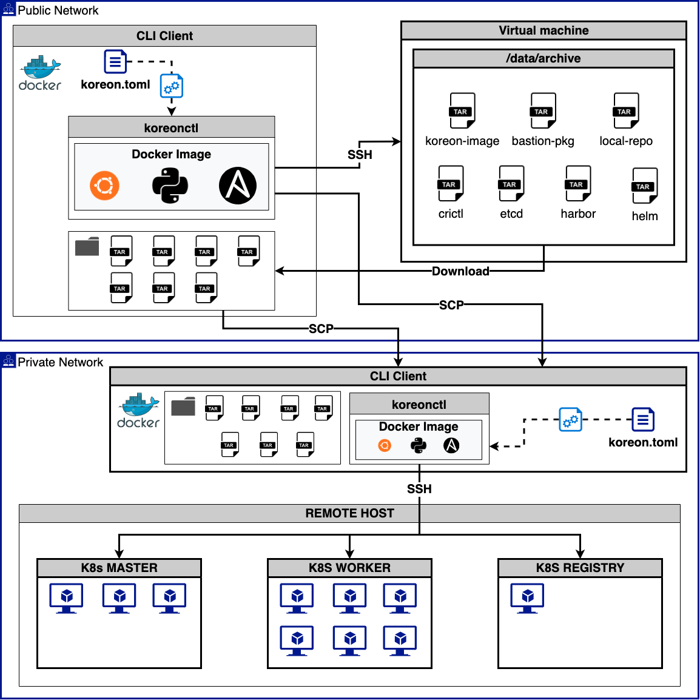

# **Kore-on**

## **구성도**



## **요구사항**

- docker v19.03.15 이상
- Ubuntu 18.04, 20.04
- CentOS/RHEL 7, 8
- SSH KEY

## **Air-gap 설치**

???+ note annotate "설치 전 필독 사항"

    폐쇄망 설치 전 사전준비 과정을 완료해야 합니다.

??? info annotate "환경구성"

    - public network CLI client (공중망)
    - public network VM (prepare-airgap 용도, 공중망)
    - bastion (폐쇄망)
    - harbor (내부 이미지 레지, 폐쇄망)
    - air-gap[1:2] (마스터1 워커2, 폐쇄망)

??? tip
    - [SSH KEY PATH]
        - 설치 될 클러스터의 SSH 접근 key값을 설정합니다
        - 이 때 PATH 값은 절대 경로여야합니다.
    - [USERNAME]
        - 설치 될 클러스터 노드의 SSH 노드의 접속 user를 설정합니다
        - 모든 노드의 user명이 같아야합니다.

1. 실행 파일명 변경 및 복사 합니다.

    ```bash
    cp koreonctl-linux-amd64 /usr/local/bin/koreonctl
    ```

2. 설치 설정파일 koreon.toml 을 기본값으로 생성 합니다.

    ```bash
    koreonctl init
    ```

3. koreon-image를 docker에 load해야 합니다.

    ```bash
    docker image load -i [koreon-image 파일 명]
    ```

4. koreon.toml 파일을 클러스터 구성에 맞게 수정 합니다.

    ```toml
    [koreon]
    closed-network = true
    local-repository-install = true
    local-repository-archive-file = "[local-repo~.tgz 파일 경로]"

    [node-pool.master]
    ip = ["[master ip]"]

    [node-pool.node]
    ip = ["[worker1 ip]", "[worker2 ip]"]

    [private-registry]
    install = true
    registry-ip = "[harbor ip]"
    registry-archive-file = "[harbor~.tgz 파일 경로]"
    ```

5. 클러스터 설치 시작

    ```bash
    korectl create -p [SSH KEY PATH] -u [USERNAME]
    ```
