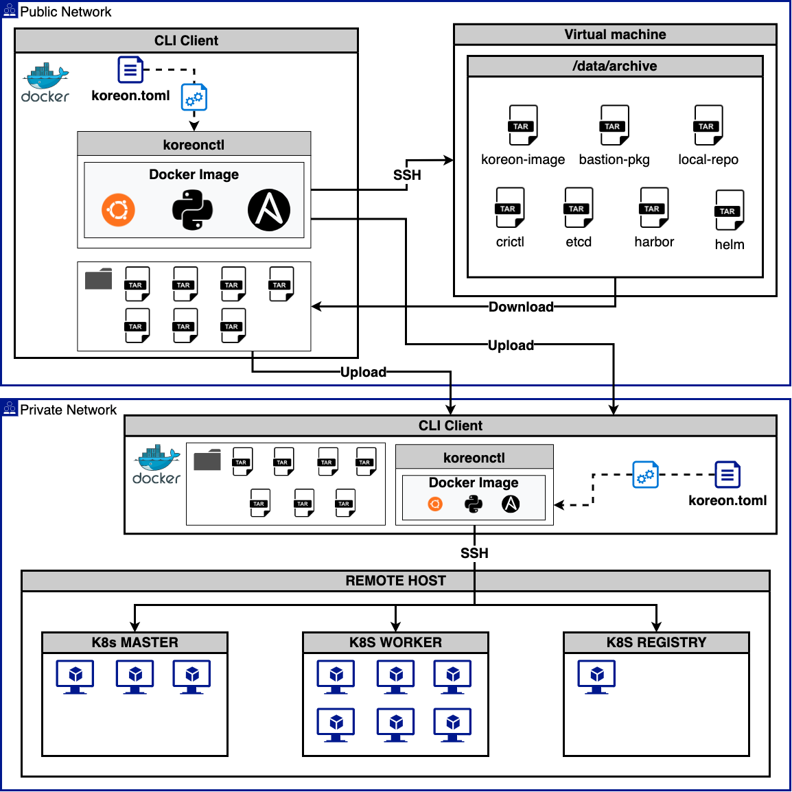

# **Kore-on**

## **구성도**



## **요구사항**

- docker v19.03.15 이상
- Ubuntu 18.04, 20.04
- CentOS/RHEL 7, 8
- SSH KEY

## **Air-gap 설치**

???+ Warning annotate "설치 전 필독 사항"

    폐쇄망 설치 전 사전준비 과정을 완료해야 합니다.

??? info annotate "환경구성"

    - public network CLI client (공중망)
    - public network VM (prepare-airgap 용도, 공중망)
    - private netwrok CLI client (폐쇄망)
    - harbor (내부 이미지 레지, 폐쇄망)
    - air-gap[1:2] (마스터1 워커2, 폐쇄망)

??? tip
    - [SSH KEY PATH]
        - 설치 될 클러스터의 SSH 접근 key값을 설정합니다
        - 이 때 PATH 값은 절대 경로여야합니다.
    - [USERNAME]
        - 설치 될 클러스터 노드의 SSH 노드의 접속 user를 설정합니다
        - 모든 노드의 user명이 같아야합니다.

1. 실행 파일명 변경 및 복사 합니다.

    ```bash
    cp koreonctl-linux-amd64 /usr/local/bin/koreonctl
    ```

2. 설치 설정파일 koreon.toml 을 기본값으로 생성 합니다.

    ```bash
    koreonctl init
    ```

3. koreon-image를 docker에 load해야 합니다.

    ```bash
    docker image load -i [koreon-image 파일 명]
    ```

4. koreon.toml 파일을 클러스터 구성에 맞게 수정 합니다.

    ??? example annotate "koreon.toml"
        ```toml
        [koreon]
        ## Required
        ## - local-repository-install: local repository installation activate. (Required when selecting the closed network.)
        ##                             It is installed on the registry host.
        ## - local-repository-port: Port number used as local repository. (Required when selecting the closed network.)
        ##                          If you use the default value, you can skip it. (default: 8080)
        ## - local-repository-archive-file: local repository packages archive file path (Required when selecting the closed network.)
        ## - local-repository-url: local repository service url (Required when selecting the closed network.)
        ##                         If you are installing a private repository, you can skip it. (default: registry-ip)
        ## Optional
        ## - cluster-name: use cluster name in config context (default: "kubernetes")
        ## - install-dir: installation scripts(harbor, shell scripts) save directory (default: "/var/lib/kore-on")
        ## - cert-validity-days: SSL validity days(default: 36500)
        ## - debug-mode: Check mode is just a simulation, and if you have steps that use conditionals that depend on the results of prior commands,
        ##				 it may be less useful for you. (default: false)
        ## - closed-network: Enable Air Gap (default: false)
        #cluster-name = "testing-cluster"
        #install-dir = "/var/lib/kore-on"
        #cert-validity-days = 36500
        #debug-mode = true

        #############################
        ########### change ############
        closed-network = true
        local-repository-install = true
        #local-repository-port = 8080
        local-repository-archive-file = "local-repo~.tgz 파일 경로"
        #local-repository-url = "http://x.x.x.x"
        ########### change ############
        #############################

        [kubernetes]
        ## Required
        ## -
        ## Optional
        ## - version: Kubernetes version (default: "latest")
        ##            If you input only the major version, the minor version automatically selects the last version.
        ## - container-runtime: use k8s cri (only containerd)
        ## - kube-proxy-mode: use k8s proxy mode [iptables | ipvs] (default: "ipvs")
        ## - service-cidr: k8s service network cidr (default: "10.96.0.0/20")
        ## - pod-cidr: k8s pod network cidr (default: "10.4.0.0/24")
        ## - node-port-range: k8s node port network range (default: "30000-32767")
        ## - audit-log-enable: k8s audit log enabled (default: true)
        ## - api-sans: Add k8s apiserver SAN [--apiserver-cert-extra-sans same as setting] (default: master[0] ip address)
        #version = "v1.23.12"
        #container-runtime = "containerd"
        #kube-proxy-mode = "ipvs"
        #service-cidr = "172.20.0.0/24"
        #pod-cidr = "10.10.0.0/24"
        #node-port-range = "30000-32767"
        #audit-log-enable = true
        #api-sans = ["x.x.x.x"]

        [kubernetes.etcd]
        ## Required
        ## - ip: k8s control plane nodes ip address. (Required when selecting the external-etcd="true")
        ## - private-ip: K8s control plane nodes private ip address. (Required when selecting the external-etcd="true")
        ##               If you use the same IP address, you can skip it.
        ## Optional
        ## - external-etcd: used external etcd than input the ip and private-ip address (default: false)
        ##                  not used than skip ip address. it is used control plane nodes as automatic.
        #external-etcd = true
        #ip = ["x.x.x.x"]
        #private-ip = ["x.x.x.x"]

        [kubernetes.calico]
        ## Required
        ## -
        ## Optional
        ## - vxlan-mode: calico VXLAN mode activate (default: false)
        #vxlan-mode = true

        [node-pool]
        ## Required
        ## -
        ## Optional
        ## - data-dir: data(backup, docker, log, kubelet, etcd, k8s-audit, containerd) root dir (default: "/data")
        ## - ssh-port: Node ssh port (default: 22)
        #data-dir = "/data"
        #ssh-port = 22

        [node-pool.master]
        ## Required
        ## - ip: k8s control plane nodes ip address.
        ## - private-ip: K8s control plane nodes private ip address.
        ##               If you use the same IP address, you can skip it.
        ## Optional
        ## - lb-ip: loadbalancer ip address (default: master[0] node ip address)
        ## - isolated: K8s control plane nodes isolated (default: false)
        ## - haproxy-install: used internal load-balancer (default: true)
        ## - lb-ip: Enter the IP address when using a load balancer (default: master[0] ip address)
        ## - lb-port: Enter the port when using a load balancer (default: "6443")

        #############################
        ########### change ############
        ip = ["master ip"]
        ########### change ############
        #############################

        #private-ip = ["x.x.x.x","x.x.x.x","x.x.x.x"]
        #isolated = true
        #haproxy-install = true
        #lb-ip = "x.x.x.x"
        #lb-port = "6443"

        [node-pool.node]
        ## Required
        ## - ip: k8s work nodes ip address.
        ## - private-ip: K8s work nodes private ip address.
        ##               If you use the same IP address, you can skip it.
        ## Optional

        #############################
        ########### change ############
        #ip = ["worker1 ip","worker2 ip"]
        ########### change ############
        #############################

        #private-ip = ["x.x.x.x", "x.x.x.x"]

        [private-registry]
        ## Required
        ## - registry-ip: Public IP address of the private registry node.
        ##                This is a required entry used when installing a private registry.
        ## - private-ip: Private IP address of the private registry node.
        ##               This is a required entry used when installing a private registry.
        ##               If you use the same IP address, you can skip it.
        ## Optional
        ## - install: private registry install (default: false)
        ## - registry-version: Private registry version. (default: latest)
        ##                     This is a required entry used when installing a private registry.
        ##                     If you input only the major version, the minor version automatically selects the last version.
        ## - registry-domain: If using a domain, please enter the domain. (default: registry-ip)
        ## - data-dir: private registry data directory (default: "/data/harbor")
        ## - registry-archive-file: registry archive file path (default: "")
        ## - public-cert: public cert activate (default: false)

        #############################
        ########### change ############
        install = true
        #registry-version = "v2.6.0"
        registry-ip = "harbor ip"
        #private-ip = "x.x.x.x"
        #registry-domain = "x.x.x.x"
        #data-dir = "/data/harbor"
        registry-archive-file = "harbor~.tgz 파일 경로"
        #public-cert = false
        ########### change ############
        #############################

        [private-registry.cert-file]
        ## Required
        ## - ssl-certificate: The certificate path used when using public-cert.
        ##                    This is a required field used when using a public certificate.
        ## - ssl-certificate-key: The certificate-key used when using public-cert.
        ##                        This is a required field used when using a public certificate.
        ## Optional
        #ssl-certificate = ""
        #ssl-certificate-key = ""

        [shared-storage]
        ## Required
        ## - storage-ip: Storage node ip address.
        ##               This is a required field used when installing the nfs server.
        ##               (this is using it to generate an inventory and generate an extra vars)
        ## - private-ip: Storage node ip address.
        ##               This is a required field used when installing the nfs server.
        ##               If you use the same IP address, you can skip it.
        ##               (this is using it to generate an inventory)
        ## - volume-dir: Storage node data directory. (default: /data/storage)
        ##               This is a required field used when installing the nfs server.
        ##               (this is using it to generate an extra vars)
        ## Optional
        ## - install: NFS Server Installation (default: false)
        #install = true
        #type = nfs
        #storage-ip = "x.x.x.x"
        #private-ip = "x.x.x.x"
        #volume-dir = "/data/storage"
        #nfs_version = "4.1"

        [prepare-airgap]
        ## Required
        ## - k8s-version: Kubernetes version (default: "latest")
        ##                If you input only the major version, the minor version automatically selects the last version.
        ## - registry-version: Private registry version. (default: latest)
        ##                     This is a required entry used when installing a private registry.
        ##                     If you input only the major version, the minor version automatically selects the last version.
        ## - registry-ip: Private registry node ip address.
        ##                This is a required field used when the pre-preparation stage of the air gap network.
        ## Optional
        ## -
        #k8s-version = "v1.21"
        #registry-version = "v2.6"
        # registry-ip = "x.x.x.x"
        ```

    ```toml title="koreon.toml"
    [koreon]
    closed-network = true
    local-repository-install = true
    local-repository-archive-file = "local-repo~.tgz 파일 경로"

    [node-pool.master]
    ip = ["master ip"]

    [node-pool.node]
    ip = ["worker1 ip", "worker2 ip"]

    [private-registry]
    install = true
    registry-ip = "harbor ip"
    registry-archive-file = "harbor~.tgz 파일 경로"
    ```

5. 클러스터 설치 시작

    ```bash
    korectl create -p [SSH KEY PATH] -u [USERNAME]
    ```

## **검증**

### **controlplane node에서 확인하는 방법**

!!! info annotate "controlplane node 관리자 계정이 아닌 일반 사용자가 Kubernetes CLI를 사용을 원하다면 아래 명령어를 사용해야 합니다."

```bash
mkdir -p $HOME/.kube
sudo cp -i /etc/kubernetes/admin.conf $HOME/.kube/config
sudo chown $(id -u):$(id -g) $HOME/.kube/config
```

### **CLI client에서 확인하는 방법**

!!! info annotate "CLI client에서 바로 확인하고 싶다면 해당 명령어를 실행합니다."

```bash
mkdir -p $HOME/.kube
sudo cp -i acloud-client-kubeconfig $HOME/.kube/config
sudo chown $(id -u):$(id -g) $HOME/.kube/config
```
