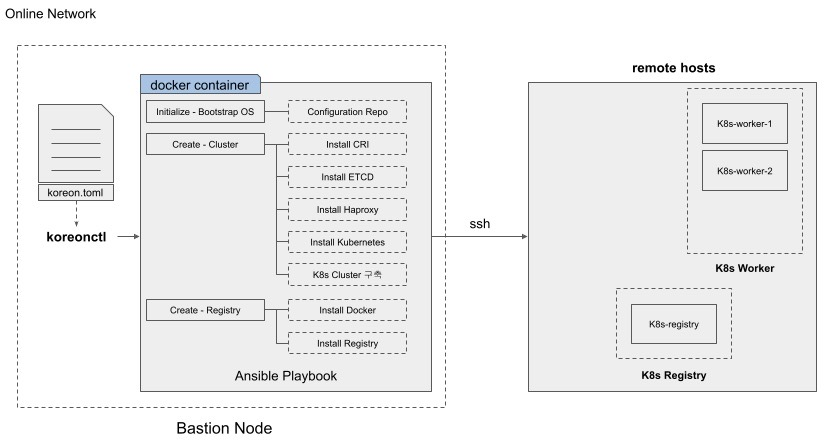

# Kore-On

## 구성도



## 요구사항

- docker v19.03.15 이상
- Ubuntu 20.04
- CentOS/RHEL 8
- SSH KEY

## 온라인 설치

> 가능하면 관리자 유저에서 실행하고 Clent 명령어를 실행한다.

1. apt 업데이트

        apt-get update
        apt-get upgrade -y

2. docker install

        apt-get install -y docker.io

      - IF Error
        - Got permission denied while trying to connect to the Docker daemon socket
           - `sudo usermod -a -G docker $USER`
           - reconnect
           - `id`
           - find docker

3. 설치파일 다운로드

        curl -LO https://github.com/acornsoft-edgecraft/kore-on/releases/download/[last version]/koreonctl-linux-amd64

        ex) curl -LO https://github.com/acornsoft-edgecraft/kore-on/releases/download/v1.3.0/koreonctl-linux-amd64

4. 설치파일 권한 부여

        chmod +x koreonctl-linux-amd64

5. CLI 적용

        cp koreonctl-linux-amd64 /usr/bin/koreonctl

6. koreon.toml 파일 다운로드

        korectl init

7. koreon.toml 파일 수정

        ```toml
        [koreon]
        # 하단의 해당하는 부분만 변경
        cluster-name = "testing-cluster"

        [node-pool.node]
        # 하단의 해당하는 부분만 변경
        ip = ["x.x.x.x","x.x.x.x","x.x.x.x"]

        [node-pool.master]
        # 하단의 해당하는 부분만 변경
        ip = ["x.x.x.x"]
        ```

8. 클러스터 설치 시작

        korectl create -p [SSH KEY PATH] -u [USERNAME]

## 검증

> 관리자 계정에서 kubetnetes CLI를 실행하여야한다.

controllplane node에서 관리자 계정이 아닌 일반 사용자가 Kubernetes CLI를 사용하기를 원하면 아래 명령어를 사용해 주세요

    mkdir -p $HOME/.kube
    sudo cp -i /etc/kubernetes/admin.conf $HOME/.kube/config
    sudo chown $(id -u):$(id -g) $HOME/.kube/config
