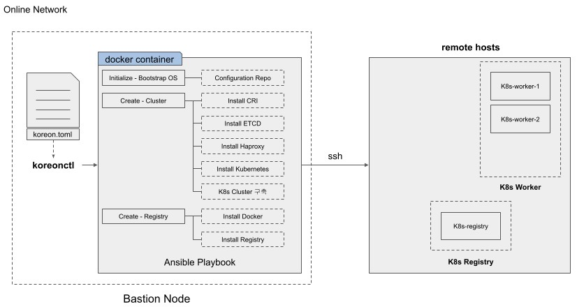

# Kore-On

## 구성도



## 요구사항

- docker
- Ubuntu 20.04
- SSH KEY

## 온라인 설치
> 가능하면 관리자 유저에서 실행하고 Bastion Node에서 명령어를 실행한다.

1. `apt-get update`

2. `apt-get upgrade -y`

3. docker install
   - `apt-get install -y docker.io`
   - IF Error
     - Got permission denied while trying to connect to the Docker daemon socket
        - `sudo usermod -a -G docker $USER`
        - reconnect
        - `id`
        - find docker

4. `curl -LO https://github.com/acornsoft-edgecraft/kore-on/releases/download/[last version]/koreonctl-linux-amd64`
      - `curl -LO https://github.com/acornsoft-edgecraft/kore-on/releases/download/v1.3.0/koreonctl-linux-amd64`

5. `chmod +x koreonctl-linux-amd64`

6. `cp koreonctl-linux-amd64 /usr/bin/korectl`

7. `korectl init` 후 sample toml 파일을 수정한다.

8. edit koreon.toml

```toml
[koreon]
# 하단의 해당하는 부분만 변경
cluster-name = "testing-cluster"

[node-pool.node]
# 하단의 해당하는 부분만 변경
ip = ["x.x.x.x","x.x.x.x","x.x.x.x"]

[node-pool.master]
# 하단의 해당하는 부분만 변경
ip = ["x.x.x.x"]
```

9. `korectl create -p [SSH KEY] -u [USERNAME]`

## 검증

controllplane node에서 root가 아닌 일반 사용자가 kubernetes CLI를 사용하기를 원하면아래 명령어를 사용해 주세요

```bash
mkdir -p $HOME/.kube
sudo cp -i /etc/kubernetes/admin.conf $HOME/.kube/config
sudo chown $(id -u):$(id -g) $HOME/.kube/config
```
